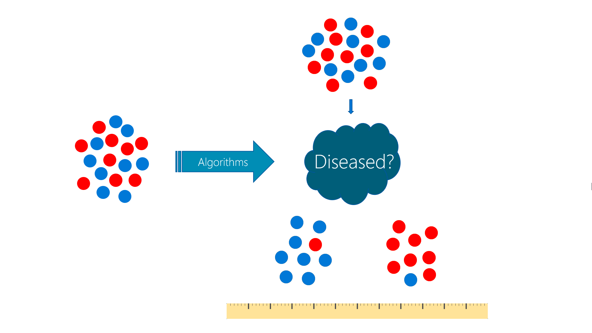
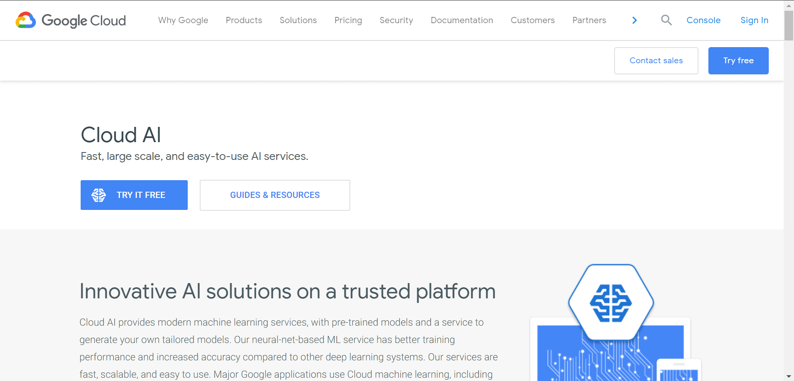
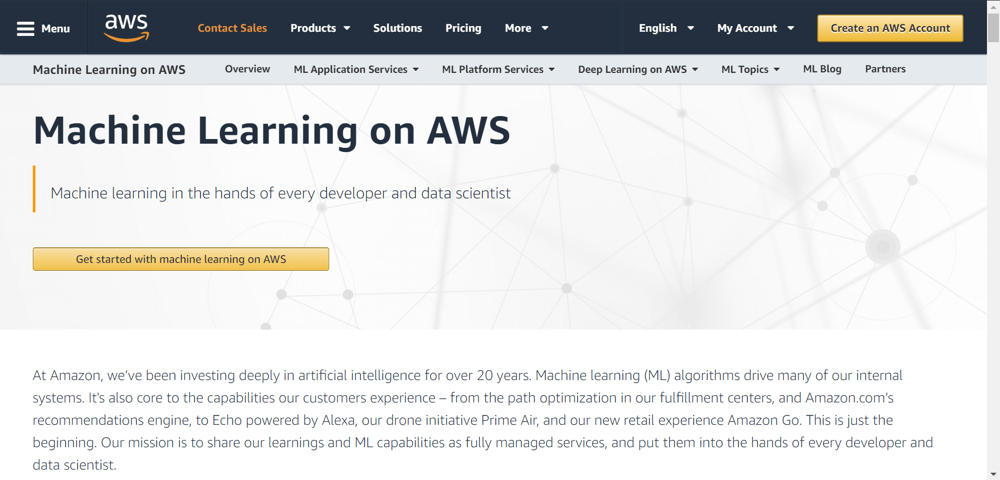
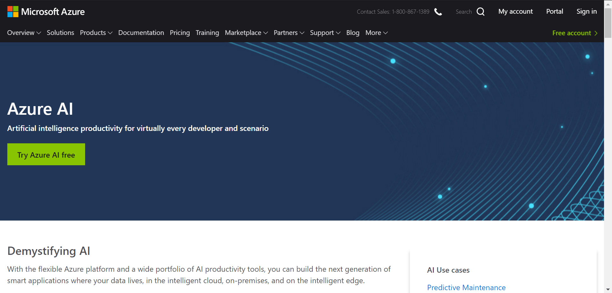
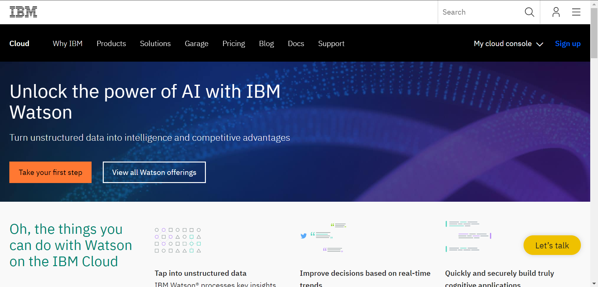
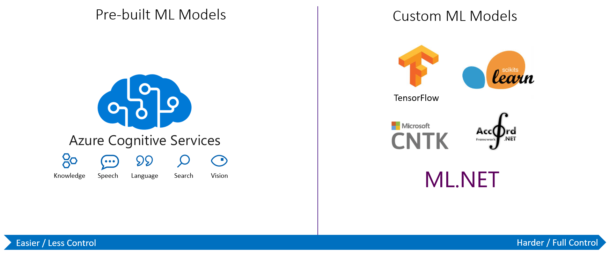

@title[Introduction]
# AI

### made easy on Cloud Platform

---

## Agenda

* AI
* Navigating AI Revolution
* Machine Learning
* Cloud AI Services
* Demo

---

## AI?

---?image=https://media.giphy.com/media/4yrXiUTCzPTeE/giphy.gif

@snap[east]
@size[2em](@color[white](What's AI?))
@snapend

---

## Artificial Intelligence

“The term "`Artificial Intelligence (AI)`" is applied when a machine mimics "cognitive" functions that humans associate with other human minds, such as "learning" and "problem solving".”

@snap[south-east]
-- Wikipedia
@snapend

+++

## Artificial Intelligence

“Artificial Intelligence is just whatever a computer can’t do yet…”

@snap[south-east]
-- Chris Bishop, Microsoft Research
@snapend

+++

## AI

“Artificial Intelligence is computers doing things that we would normally think of as intelligent in humans.”

@snap[south-east]
-- Rick Barazza, Microsoft DX
@snapend

---

+++

+++

---

## Navigating AI Revolution

+++?image=assets/image/ai-nav-01.png&opacity=0

+++?image=assets/image/ai-nav-02.png&opacity=0

+++?image=assets/image/ai-nav-03.png&opacity=0

+++

## AI Enablers

@ol
* New combo of Math
* Big data
* Massive Computation
@olend

---

## Machine Learning

+++?image=assets/image/baby01.png&opacity=0

+++?image=assets/image/baby02.png&opacity=0

+++?image=assets/image/baby03.png&opacity=0

+++?image=assets/image/baby04.png&opacity=0

+++?image=assets/image/baby05.png&opacity=0

+++?image=assets/image/baby06.png&opacity=0

+++?image=assets/image/baby07.png&opacity=0

+++?image=assets/image/baby08.png&opacity=0

+++?image=assets/image/robot01.png&opacity=0

+++?image=assets/image/robot02.png&opacity=0

+++?image=assets/image/robot03.png&opacity=0

+++?image=assets/image/robot04.png&opacity=0

+++

## Disease Classification

* Interview doctors and specialists
* Research more on text books
* Design a decision algorithm
* Implement the algorithm
* Fine-tune for the best result

+++?image=assets/image/robot04.png&opacity=0

+++?image=assets/image/mlx01.png&opacity=0

+++?image=assets/image/mlx02.png&opacity=0

+++?image=assets/image/mlx03.png&opacity=0

+++?image=assets/image/mlx04.png&opacity=0

+++?image=assets/image/mlx05.png&opacity=0

+++?image=assets/image/mlx06.png&opacity=0

+++?image=assets/image/mlx07.png&opacity=0

+++?image=assets/image/mlx08.png&opacity=0

+++?image=assets/image/mlx09.png&opacity=0

+++?image=assets/image/mlx10.png&opacity=0

+++

## Machine Learning Categories

* Supervised Learning

	The computer is presented with example inputs and their desired outputs

* Unsupervised Learning

	No labels are given to the learning algorithm

+++

## Supervised Learning

+++

## Unsupervised Learning

---

## AI on Cloud Platforms

+++

## Cloud AI on Google Cloud

[https://cloud.google.com/products/ai/](https://cloud.google.com/products/ai/)

+++

## Machine Learning on AWS

[https://aws.amazon.com/machine-learning/](https://aws.amazon.com/machine-learning/)

+++

## Azure AI on Microsoft Azure

[https://azure.com/ai](https://azure.com/ai)

+++

## IBM Watson on IBM Cloud

[https://www.ibm.com/cloud/ai](https://www.ibm.com/cloud/ai)

---

## Comparing Machine Learning as a Service:

### Amazon, Microsoft Azure, Google Cloud AI, IBM Watson

@snap[south-east]
From [AltexSoft Data Science Blog Post](https://www.altexsoft.com/blog/datascience/comparing-machine-learning-as-a-service-amazon-microsoft-azure-google-cloud-ai-ibm-watson/)
@snapend

+++?image=assets/image/cloud-compare-01.png&size=auto 90%

+++?image=assets/image/cloud-compare-02.png&size=auto 90%

+++?image=assets/image/cloud-compare-03.png&size=auto 90%

+++?image=assets/image/cloud-compare-04.png&size=auto 90%

+++

## Various machine learning solutions

+++

## ML as a Service

* Beaware executives who are going to buy tools solving tasks at the higher levels.
* However, it seems that we’ll see far more companies turning to ML-as-a-service to avoid expensive talent acquisitions and still possess versatile data tools.
* The right move is to articulate what you plan to achieve with machine learning as early as possible.

---

## Demo

### Cognitive Services

+++

## Demo

### Machine Learning Studio

---

### Questions?

@fa[twitter gp-contact](@tlaothong)

@fa[github gp-contact](tlaothong)

@fa[facebook gp-contact](@digitalthailandclub)
