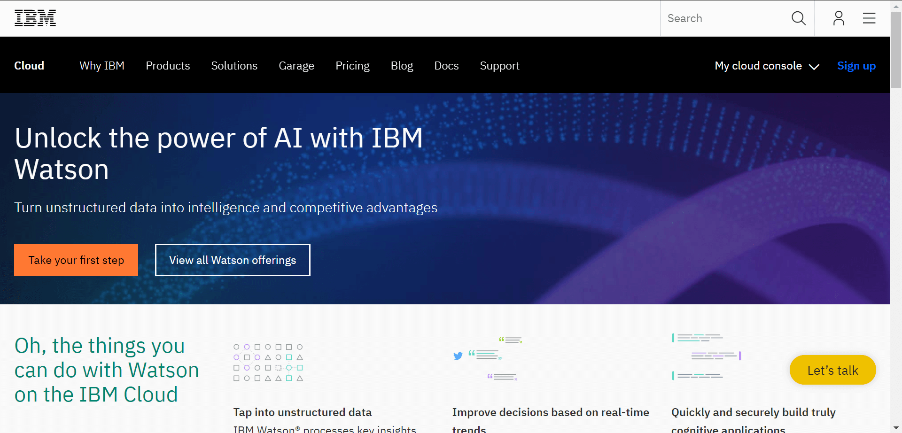

# AI

### On Cloud Platform

Teerachai Laothong 
Sakul Jaruthanaset

---
@title[AI definition 3]

## AI

“Artificial Intelligence is computers doing things that we would normally think of as intelligent in humans.”

@snap[south-east]
-- Rick Barazza, Microsoft DX
@snapend

+++
@title[AI example 2]

+++
@title[AI example 3]

---

## AI Enablers

@ol
* New combo of Math
* Big data
* Massive Computation
@olend

---

## AI on Cloud Platforms

+++

## Cloud AI on Google Cloud

[https://cloud.google.com/products/ai/](https://cloud.google.com/products/ai/)

+++

## Machine Learning on AWS

[https://aws.amazon.com/machine-learning/](https://aws.amazon.com/machine-learning/)

+++

## IBM Watson on IBM Cloud

[https://www.ibm.com/cloud/ai](https://www.ibm.com/cloud/ai)

+++

## Azure AI on Microsoft Azure

[https://azure.com/ai](https://azure.com/ai)

---

## Comparing Machine Learning as a Service:

### Amazon, Microsoft Azure, Google Cloud AI, IBM Watson

@snap[south-east]
From [AltexSoft Data Science Blog Post](https://www.altexsoft.com/blog/datascience/comparing-machine-learning-as-a-service-amazon-microsoft-azure-google-cloud-ai-ibm-watson/)
@snapend

+++?image=assets/image/cloud-compare-01.png&size=auto 90%

+++?image=assets/image/cloud-compare-02.png&size=auto 90%

+++?image=assets/image/cloud-compare-03.png&size=auto 90%

+++?image=assets/image/cloud-compare-04.png&size=auto 90%

+++

## Various machine learning solutions

+++

## ML as a Service

* Beaware executives who are going to buy tools solving tasks at the higher levels.
* However, it seems that we’ll see far more companies turning to ML-as-a-service to avoid expensive talent acquisitions and still possess versatile data tools.
* The right move is to articulate what you plan to achieve with machine learning as early as possible.

---

## Demo

### Machine Learning Studio

+++

+++

## Demo

### Cognitive Services

---

“I spent last semester building a regression model in Python, and I just did the same thing in 10 minutes with Azure ML”

Note:
This quote came from a graduate student who attended this class at UMass. He had already accepted at offer to go to work for Microsoft post-graduation. 

---

### Questions?

@fa[twitter gp-contact](@tlaothong)

@fa[github gp-contact](tlaothong)

@fa[facebook gp-contact](@digitalthailandclub)
